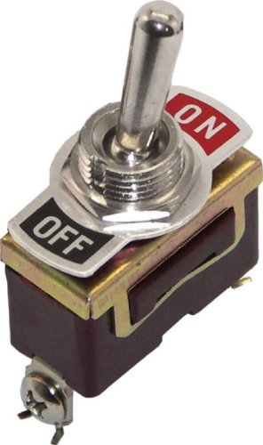

# Togl




## Installation

Add this line to your application's Gemfile:

```ruby
gem 'togl'
```

And then execute:

    $ gem install -g


Or install it directly:

    $ gem install togl

## Usage

First have a configuration file where you add features as you introduce them

``` ruby
Togl.configure do
  use Togl::Adapter::RackSession.new

  feature :recommendations
  feature :threaded_comments
end
```

This example uses only one adapter, one that monitors get parameters for special
`enable_features` or `disable_features` keys. To make it work, add the
`Togl::Rack::Middleware` to your Rack stack.

``` ruby
use Togl::Rack::Middleware
```

Now in your code you can check if a feature is on

``` ruby
if Togl.on? :recommendations
  # ... implement the feature ...
end
```

Have a look at the `rails_example/` directory for how to use it with Rails, in
particular how to have a "features" model, so you can do this on the console:

``` ruby
> Feature.enable! :recommendations
> Feature.disable! :recommendations
> Feature.reset! :recommendations
```

## Contributing

1. Fork it ( https://github.com/plexus/togl/fork )
2. Create your feature branch (`git checkout -b my-new-feature`)
3. Commit your changes (`git commit -am 'Add some feature'`)
4. Push to the branch (`git push origin my-new-feature`)
5. Create a new Pull Request
